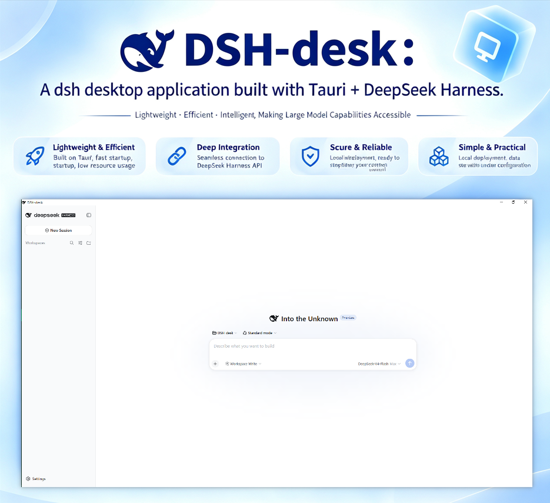

# DSH-desk
English|[中文](README.md)
> A **Windows desktop app** built on [DeepSeek Harness](https://github.com/deepseek-ai/deepseek-harness) + [Tauri](https://tauri.app/).
> **Lightweight — no bulky installers**

  

## Features

- **Ready to use out of the box**: No Node.js install, no pnpm setup, no command line — double-click and go.
- **Windows system integration**: Autostart toggle, hotkey display, restart dsh, one-click open log directory, check for the latest version; dsh approval events are mirrored as system notifications.
- **Shared data with the web version**: The desktop app and the web version share the same user data (profiles, sessions, credentials under `~/.dsh`), so switching between them is seamless.
- **Full plugin ecosystem reuse**: Built-in [dsh-market](https://github.com/dsh-market/dsh-market/tree/main) plugin marketplace; since the Harness profile and plugin mechanisms are reused, community plugins install and work as usual.
- **Lightweight install, fast startup**: The sidecar ships as a single archive inside the installer; the first run extracts it locally with a progress display, subsequent launches are instant, and upgrades refresh the engine automatically.
- **Clear security boundary**: WebView only allows local embedded pages and the local Harness origin; external links are always handed to the system browser. Credentials live only in the user's local Harness directory and are never read by the desktop shell.

## System Requirements

| Item | Requirement |
|---|---|
| OS | Windows 10 / 11, x64 |
| WebView2 Runtime | Evergreen (built into Windows 11; the installer bootstraps it on Windows 10 if missing) |
| Administrator rights | Not required (per-user install) |

## Download & Install

All installers come from **GitHub Releases** (the only distribution channel): <https://github.com/JiaosSir/DSH-desk/releases>

### Option 1: Installer (recommended)

1. Download `DSH-desk_<version>_x64-setup.exe`;
2. Double-click to install (no admin rights; you can choose the install directory, which defaults to the current user's Programs folder);
3. Launch from the Start Menu or a desktop shortcut.

### Option 2: Portable

1. Download `DSH-desk-portable-<version>-x64.zip`;
2. Extract it to any directory (a fixed location such as `D:\DSH-desk` is recommended);
3. Double-click `dsh-desk.exe` to run.

## Coexistence with CLI dsh / the web version

- The desktop and web versions **share the same user data**: profiles, sessions, credentials, and plugins under `~/.dsh`.
- The desktop app **always uses its bundled engine** (bundled Node + `@deepseek-ai/dsh`), independent of any dsh installed on the command line.
- Keeping the desktop app and your usual dsh CLI on the **same rc version** (currently `0.1.1-rc.2`) is recommended to avoid profile dependency re-installs from version drift (see [FAQ](docs/FAQ.en.md#can-the-desktop-and-cli-versions-of-dsh-coexist)).

## Upgrade & Uninstall

- **Upgrade**: Just download the new installer and **install over the existing one**; profiles, sessions, and credentials under `~/.dsh` are kept intact, and the engine refreshes automatically on the first start after upgrading.
- **Uninstall**: Via "Settings → Apps → Installed apps", or re-run the installer and choose uninstall. Uninstalling **does not delete** your personal data under `~/.dsh` (delete that directory manually for a full cleanup).
- **Portable**: delete the extracted directory.

## Privacy

- **Zero telemetry**: the sidecar is forced to run with `DSH_TELEMETRY_DISABLED=1`; no statistics, no reporting, no ads.
- **Local logs**: under `~/.dsh/desktop/logs/` (or the path defined by the `DSH_HOME` environment variable), reachable via the tray menu or the "Open log directory" button on the error page; logs are only used for troubleshooting and can be deleted at any time.

## Desktop Features at a Glance

| Feature | Description |
|---|---|
| Tray menu | Show/hide window, restart dsh, open log directory, quit |
| Global hotkey | Default `Ctrl+Alt+D` to show/hide (to change: edit `hotkey` in `~/.dsh/desktop/config.json` and restart the app; invalid values fall back to the default) |
| System notifications | Approval requests from dsh are mirrored as notifications; approvals are still completed inside the window |
| Autostart | Toggle in the "Desktop" section of settings, off by default |
| Window state | Size/position remembered and restored on the next launch |
| Single instance | A second launch focuses the existing window |

## Related Links

- Upstream project: [DeepSeek Harness](https://github.com/deepseek-ai/deepseek-harness) (MIT)
- FAQ: [`docs/FAQ.en.md`](docs/FAQ.en.md)
- Windows integration bridge plugin: [`packages/dsh-desk-bridge`](packages/dsh-desk-bridge)
- License: [`LICENSE`](LICENSE) (MIT)
