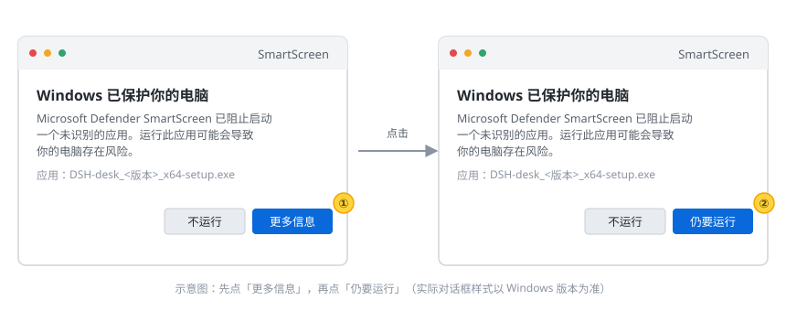

# DSH-desk

> 基于 [DeepSeek Harness](https://github.com/deepseek-ai/deepseek-harness) 二次开发的 **Windows 桌面应用**。
> **不装 Node、不用命令行，双击即用。**

DSH-desk 是 DeepSeek Harness 的桌面分发形态：它以二次开发的方式，把 Harness 的 Web 界面封装为原生 Windows 桌面应用。宿主引擎（`@deepseek-ai/dsh`）、Web UI、客户端插件体系与 Slot/主题生态全部来自 DeepSeek Harness 并保持完全兼容；本项目在其之上增加了一层 Tauri 2 桌面壳与桌面级集成能力（窗口、托盘、快捷键、通知、开机自启等）。

## 特点与优势

- **开箱即用**：免安装 Node.js、免配置 pnpm、不用碰命令行——应用随包自带 Node 运行时与钉死版本的 Harness 引擎（sidecar），双击即用。
- **桌面级体验**：独立窗口、系统托盘、全局快捷键（缺省 `Ctrl+Alt+D` 唤起/隐藏）、开机自启、系统通知、单实例运行；关闭窗口即退出，不留后台进程。
- **深度集成而非简单套壳**：通过随包安装的桥接插件，在 Web UI 设置区新增「桌面」分区——开机自启开关、快捷键展示、重启宿主、一键打开日志目录、查看最新版本；宿主审批事件会镜像为系统通知。
- **与网页版数据互通**：桌面端与网页版共享同一份用户数据（`~/.dsh` 下的 profile、会话、凭证），两边切换无缝衔接。
- **插件生态完全复用**：沿用 Harness 的 profile 与插件机制，社区插件照常安装使用。
- **安装轻量、启动快**：sidecar 以单个归档文件随安装包分发（压缩由安装器完成），安装只解一个大文件（不再逐文件解压数万个小文件）；首次运行在本地解压并显示进度，之后每次启动秒开，升级版本自动刷新。
- **安全边界清晰**：WebView 仅放行本地内嵌页面与本机 Harness 源，外部链接一律移交系统浏览器打开；凭证只存在用户本地的 Harness 目录中，桌面壳不读取其内容。
- **零遥测**：sidecar 强制关闭遥测（`DSH_TELEMETRY_DISABLED=1`），现在不做、以后也不做。

## 系统要求

| 项目 | 要求 |
|---|---|
| 操作系统 | Windows 10 / 11，x64 |
| WebView2 Runtime | Evergreen（Windows 11 自带；Windows 10 缺失时安装器会自动引导安装） |
| 管理员权限 | 不需要（每用户安装） |

## 下载与安装

所有安装包只从 **GitHub Releases**（唯一发布渠道）下载：<https://github.com/JiaosSir/DSH-desk/releases>

### 方式一：安装版（推荐）

1. 下载 `DSH-desk_<版本>_x64-setup.exe`；
2. 双击安装（免管理员权限，可自选安装目录，缺省为当前用户的 Programs 目录）；
3. 从开始菜单或桌面快捷方式启动。

### 方式二：便携版

1. 下载 `DSH-desk-portable-<版本>-x64.zip`；
2. 解压到任意目录（建议放在固定位置，如 `D:\DSH-desk`）；
3. 双击 `dsh-desk.exe` 即可运行，无需安装、不写安装类注册表项、不设开机项。

### SmartScreen 提示（未签名，预期行为）

v1 安装包未做代码签名，Windows SmartScreen 会弹出「Windows 已保护你的电脑」提示，这是**预期行为**：

1. 在提示窗口点击 **「更多信息」**；
2. 点击 **「仍要运行」**；
3. 若弹出 UAC 风格确认，选择 **「是」**。



便携版同理：若解压后的 `dsh-desk.exe` 首次运行时被拦截，按上述步骤操作，或在资源管理器中右键该文件 → **属性** → 勾选 **解除锁定** → 确定，再双击运行。

> 安全说明：本应用开源（MIT），构建产物由 CI 从源码自动构建上传；你也可以从源码自行构建（见[开发者文档](docs/dev/BUILDING.md)）后对比校验。

## 首次使用

1. **首次启动**：等待页会自动准备本地环境——解压运行引擎（显示进度条，通常 0.5–2 分钟）并初始化插件配置，完成后自动进入主界面；之后每次启动秒开。初始化插件需要联网，但**网络不可用不会阻塞启动**（仅跳过桌面桥接插件，其余照常可用，详见 [FAQ](docs/FAQ.md#首次启动卡在等待页--提示网络失败)）。
2. **配置 API key**：首次进入会在页面内引导填写 DeepSeek API key——前往 [DeepSeek 开放平台](https://platform.deepseek.com) 创建并复制 key（形如 `sk-…`），粘贴保存即可。
   - 如果你已经用过 CLI 版 dsh（`~/.dsh` 里已有 key），会自动跳过此步。
   - key 写入 `~/.dsh/.credentials.yaml`（受管凭据文档，`0600` 权限），与 CLI 版使用同一凭证机制；`~/.dsh/.env` 等旧来源仅作回退读取层。桌面壳只检测「有没有」，不读取 key 内容。
3. **开始使用**：选择模型，直接对话。审批类操作（如执行命令、写文件）仍在窗口内完成，与网页版体验一致。

## 与 CLI 版 dsh / 网页版共存

- 桌面端与网页版**共享同一份用户数据**：`~/.dsh` 下的 profile、会话、凭证、插件。
- 桌面端**永远使用随包自带的引擎**（自带 Node + 钉版 `@deepseek-ai/dsh`），不检测、不借用、不升级你系统里安装的 dsh；两边可同时安装、随时切换。
- 建议桌面端与你常用的 CLI 版本保持**同一 rc 版本**（当前 `0.1.1-rc.2`），避免版本交错导致 profile 依赖反复重装（详见 [FAQ](docs/FAQ.md#桌面版和-cli-版-dsh-能一起用吗)）。

## 升级与卸载

- **升级**：直接下载新版安装包**覆盖安装**即可；`~/.dsh` 中的 profile、会话、凭证原样保留，升级后首次启动自动刷新引擎版本。
- **卸载**：通过「设置 → 应用 → 已安装的应用」卸载，或重跑安装包选择卸载；卸载**不会删除** `~/.dsh` 中的个人数据（如需彻底清理，手动删除该目录）。
- **便携版**：删除解压目录即完成卸载。

## 隐私与网络

- **零遥测**：sidecar 强制 `DSH_TELEMETRY_DISABLED=1`；无统计、无上报、无广告。
- **本地日志**：壳与 sidecar 的滚动日志（各 1MB×2）写在 `~/.dsh/desktop/logs/`（尊重 `DSH_HOME` 环境变量），可通过托盘菜单或错误页「打开日志目录」直达；日志仅用于排查问题，可随时删除。
- **出站流量清单**（全部）：

| 目标 | 时机 | 说明 |
|---|---|---|
| `api.deepseek.com` | 对话/调用模型时 | DeepSeek 官方 API，使用你自己的 key |
| `registry.npmjs.org` | 首次初始化 / 安装插件时 | 官方 npm registry，插件分发渠道 |
| 微软 WebView2 引导安装源 | 仅当系统缺 WebView2 时一次性 | 安装器引导 |
| `github.com/JiaosSir/DSH-desk/releases` | 你点击设置区「查看最新版」时 | 在系统浏览器打开，仅此一次跳转 |

- **没有**自动更新检查、没有更新清单、没有除上述以外的任何请求；桌面应用自身**不联网检查版本**。

## 桌面特性速览

| 特性 | 说明 |
|---|---|
| 托盘菜单 | 显示/隐藏窗口、重启宿主、打开日志目录、退出 |
| 全局快捷键 | 缺省 `Ctrl+Alt+D` 唤起/隐藏（改键：编辑 `~/.dsh/desktop/config.json` 的 `hotkey`，重启应用生效；非法值自动回退缺省） |
| 系统通知 | 宿主收到审批请求时镜像通知，审批操作仍在窗口内完成 |
| 开机自启 | 设置区「桌面」分区开关，默认关 |
| 窗口记忆 | 尺寸/位置自动记忆，下次启动恢复 |
| 单实例 | 二次启动自动聚焦已有窗口 |

## 技术架构（简述）

```
┌────────────────────────────────────────────┐
│ Tauri 2 壳（Rust）                          │
│  窗口/托盘/快捷键/通知 · IPC 桥 · 监督任务    │
└───────────────┬────────────────────────────┘
                │ 监督 sidecar：启动 → 等待就绪 → WebView 导航
┌───────────────▼────────────────────────────┐
│ sidecar：自带 Node + pnpm + @deepseek-ai/dsh │
│ 在 127.0.0.1 起 Harness 宿主（Web UI + API）  │
└───────────────┬────────────────────────────┘
                │ window.__DSH_DESK__（桥接插件）
                ▼
        WebView2 中的 Harness Web UI
```

## 相关链接

- 上游项目：[DeepSeek Harness](https://github.com/deepseek-ai/deepseek-harness)（MIT）
- 常见问题：[`docs/FAQ.md`](docs/FAQ.md)
- 开发者文档：[`docs/README.md`](docs/README.md)（环境准备/启动/测试）与 [`docs/dev/BUILDING.md`](docs/dev/BUILDING.md)（构建与发布）
- 桥接插件：[`packages/dsh-desk-bridge`](packages/dsh-desk-bridge)
- 设计规格：[`docs/specs/2026-08-19-desktop-shell-design.md`](docs/specs/2026-08-19-desktop-shell-design.md)
- 实施计划：[`docs/plans/2026-08-19-implementation-plan.md`](docs/plans/2026-08-19-implementation-plan.md)
- 开源许可：[`LICENSE`](LICENSE)（MIT）
